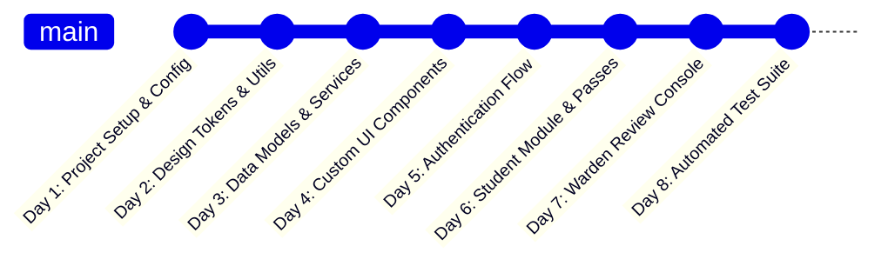

# 🏢 HostelGo — Digital Hostel Outing & Gate Pass System

A complete, production-grade Flutter application engineered for university colleges and student hostels to digitize outing permissions, multi-day home leaves, discretionary warden reviews, gate departures, returns, and digital gate pass verification.

---

## 📑 Table of Contents

1. [Executive Summary & Problem Statement](#-executive-summary--problem-statement)
2. [Key Capabilities & Modules](#-key-capabilities--modules)
3. [Architecture & Technology Stack](#-architecture--technology-stack)
4. [Folder-by-Folder Codebase Structure](#-folder-by-folder-codebase-structure)
5. [Day-by-Day GitHub Commit Roadmap](#-day-by-day-github-commit-roadmap)
6. [Detailed Code & Flow Explanation](#-detailed-code--flow-explanation)
7. [Cloud Firestore Data Schema](#-cloud-firestore-data-schema)
8. [Security Rules & Access Control](#-security-rules--access-control)
9. [Automated Testing & Verification](#-automated-testing--verification)
10. [Step-by-Step Setup Guide](#-step-by-step-setup-guide)

---

## 🌟 Executive Summary & Problem Statement

Traditional hostel register books and manual paper passes create severe friction:
* Paper slips are easily forged, damaged, or lost.
* Gate security staff cannot verify if an outing approval is authentic or expired.
* Wardens lack real-time visibility into which students are currently outside campus or overdue.
* Long-term multi-day leaves (festivals, vacations, medical emergencies) require complex physical forms.

**HostelGo** solves this with a **100% digital, zero-hardware, zero-sensor solution** powered by **Flutter, Firebase Authentication, and Cloud Firestore**.

---

## 🎯 Key Capabilities & Modules

### 👨‍🎓 1. Student Portal
* **Institutional Registration**: Self-registration securely tagged to the `student` role with required institutional attributes (Student ID, Hostel Block, Room Number).
* **Flexible Outing System**:
  * **Local Outing (Same Day)**: Leaving and expected return times on the same day.
  * **Home Visit / Multi-Day Leave**: Select date ranges up to 365 days in advance with live duration calculation (`N Days Leave`).
* **100% Warden Discretionary Review**: Students can provide detailed justifications and optional guardian remarks; wardens review each request on a case-by-case basis.
* **Persistent Bottom Navigation**: Seamless tab navigation (`Home`, `Requests`, `Profile`) that remains fixed across all main sections.
* **Live Conflict Prevention**: Disallows creating overlapping requests if an active request (`pending`, `approved`, or `outside`) already exists.
* **Verified Digital Gate Pass**: Visual digital pass ticket showing student identity, outing destination, approval timestamp, and validity status.
* **Real-time Status Updates**: Live notifications of status changes (`pending` $\rightarrow$ `approved` / `rejected` with explanation).

### 🛡️ 2. Warden & Administration Console
* **Real-Time Overview Metrics**:
  * Live pending approval count badge.
  * Approved passes for today.
  * Students currently outside campus.
  * Real-time **Overdue tracking** for students who have exceeded their expected return time.
* **Discretionary Review Queue**: In-depth review modal with student identity, purpose, date/time range, and remarks. Option to **Approve** or **Reject with required reason**.
* **Gate Movement Controls**:
  * **Gate Departure**: Record departure timestamp when student leaves the gate (`approved` $\rightarrow$ `outside`).
  * **Hostel Return**: Record return timestamp when student enters the gate (`outside` $\rightarrow$ `returned`).
* **Global Search & Filterable Logs**: Search by student name, ID, hostel, destination, or request ID across all historical records.

---

## 🛠️ Architecture & Technology Stack

```
+-------------------------------------------------------------+
|                      Flutter Client                         |
|  Material 3 + Plus Jakarta Sans + Custom Vector Canvas UI   |
+------------------------------+------------------------------+
                               |
                               v
+------------------------------+------------------------------+
|                      Service Layer                          |
|    - AuthService (Firebase Auth, Session, Claims)           |
|    - FirestoreService (Reactive Streams, Transactions)      |
+------------------------------+------------------------------+
                               |
                               v
+------------------------------+------------------------------+
|                   Cloud Backend Services                    |
|    - Firebase Authentication (Email/Password Auth)          |
|    - Cloud Firestore (Real-Time Document Database)          |
|    - Firestore Security Rules (Role-Based Access Control)   |
+-------------------------------------------------------------+
```

* **Frontend**: Flutter 3.44+ & Dart 3.12+
* **Backend Database**: Cloud Firestore (Real-time snapshot streams & compound queries)
* **Authentication**: Firebase Authentication
* **Typography**: Google Fonts (*Plus Jakarta Sans*)
* **Design Language**: Soft modern palette (`#0F766E` Primary Teal, `#CCFBF1` Soft Teal, `#F3F4F6` Background)

---

## 📂 Folder-by-Folder Codebase Structure

```
lib/
├── firebase_options.dart               # Generated Firebase multi-platform configuration
├── main.dart                           # Application entry point, Material 3 theme & root routing
│
├── utils/                              # Core design tokens, constants & validation helpers
│   ├── app_colors.dart                 # Soft modern color palette, gradients & drop shadows
│   ├── constants.dart                  # Role names, status codes, collections & hostel blocks
│   └── validators.dart                 # Email, password, student ID & chronological time validators
│
├── models/                             # Immutable data models with serialization
│   ├── user_model.dart                 # UserModel: UID, name, email, student ID, hostel, room, role
│   ├── outing_request_model.dart       # OutingRequestModel: Multi-day helpers, overdue logic, timestamps
│   └── feedback_model.dart             # FeedbackModel: 1-5 star ratings, categories, warden replies
│
├── services/                           # Firebase integration & backend business logic
│   ├── auth_service.dart               # User registration, sign in, sign out, password reset
│   └── firestore_service.dart          # Real-time request streams, lifecycle transitions & feedback CRUD
│
├── widgets/                            # Reusable, standalone UI components
│   ├── app_logo.dart                   # Custom vector canvas painter matching the HostelGo emblem
│   ├── custom_button.dart              # Multi-variant animated interactive button
│   ├── status_badge.dart               # Color-coded status badge with icons (PENDING, APPROVED, etc.)
│   ├── dashboard_stat_card.dart        # 2x2 metric cards with interactive tap-to-filter callbacks
│   ├── outing_request_card.dart        # Full outing request card with multi-day badge & timestamps
│   └── empty_state_view.dart           # Clean empty state illustration with action buttons
│
├── screens/
│   ├── auth/                           # Authentication & Onboarding
│   │   ├── splash_screen.dart          # Animated startup screen with role-based session router
│   │   ├── login_screen.dart           # Clean email/password login with forgot password modal
│   │   └── register_screen.dart        # Multi-role registration (Student / Warden)
│   │
│   ├── student/                        # Student Console
│   │   ├── student_dashboard.dart      # Persistent shell (Home, Apply, Requests, Profile)
│   │   ├── apply_outing_screen.dart    # Segmented single/multi-day leave form with live duration
│   │   ├── my_requests_screen.dart     # Standalone / embeddable request search and filter screen
│   │   ├── request_details_screen.dart # In-depth lifecycle timeline & approval details
│   │   ├── digital_gate_pass_screen.dart # Verified digital QR gate pass ticket
│   │   ├── student_feedback_screen.dart # 1-5 Star rating & grievance submission with history
│   │   ├── student_profile_screen.dart # Editable student profile details
│   │   └── history_screen.dart         # Historical archive of past student outings
│   │
│   └── warden/                         # Warden Console
│       ├── warden_dashboard.dart       # Persistent 4-tab shell (Home, Requests, Logs, Profile)
│       ├── pending_requests_screen.dart# Searchable pending approvals queue
│       ├── request_review_screen.dart  # Discretionary review modal: Approve or Reject with reason
│       ├── approved_outings_screen.dart# Approved gate passes ready for departure
│       ├── currently_outside_screen.dart# Real-time monitor for students outside with Overdue alerts
│       ├── warden_feedbacks_screen.dart# Feedback review console, rating analytics & reply modal
│       ├── warden_history_screen.dart  # Global history logs with status chips and search
│       └── warden_profile_screen.dart  # Warden administrative profile & discretionary policy guide
│
test/                                   # Automated test suite (16 Unit & Widget Tests)
├── models_test.dart                    # Serialization, role checks, multi-day duration & overdue tests
├── validators_test.dart                # Email, password, student ID & chronological time validation tests
├── widget_test.dart                    # StatusBadge & OutingRequestCard widget rendering tests
└── feedback_test.dart                  # FeedbackModel serialization, copyWith, rating and date tests
```

---

## 📅 Day-by-Day GitHub Commit Roadmap

Follow this daily sequence to build a clean, logical, and impressive GitHub commit history:



---

### 🟢 DAY 1: Project Initialization, Config & Security
**Objective**: Set up Flutter dependencies, Android launcher configuration, and Cloud Firestore security rules.

```bash
git add pubspec.yaml firestore.rules android/app/src/main/AndroidManifest.xml lib/firebase_options.dart
git commit -m "chore(setup): configure dependencies, android manifest, firebase options and security rules"
```

* **Files Added**:
  * `pubspec.yaml`: Flutter dependencies (`firebase_core`, `firebase_auth`, `cloud_firestore`, `google_fonts`, `intl`).
  * `firestore.rules`: Role-based rules enforcing student isolation and warden discretionary authority.
  * `android/app/src/main/AndroidManifest.xml`: Set application label to `HostelGo`.
  * `lib/firebase_options.dart`: Multi-platform Firebase credentials.

---

### 🟢 DAY 2: Design Tokens, Color Palette & Validators
**Objective**: Establish the soft modern visual tokens and utility validators.

```bash
git add lib/utils/
git commit -m "feat(core): add soft color palette, constants and form validation utilities"
```

* **Files Added**:
  * `lib/utils/app_colors.dart`: Design tokens (`#0F766E` primary, `#CCFBF1` soft teal, `#FEF3C7` pending amber, `#D1FAE5` approved emerald, `#FEE2E2` rejected red).
  * `lib/utils/constants.dart`: Role definitions (`student`, `warden`), status constants, hostel block options, and common purpose presets.
  * `lib/utils/validators.dart`: Validations for email regex, passwords, student IDs, and chronological leaving/return times.

---

### 🟢 DAY 3: Data Architecture & Service Layer
**Objective**: Build immutable data models and Firebase service wrappers.

```bash
git add lib/models/ lib/services/
git commit -m "feat(data): implement User and OutingRequest models with Auth and Firestore services"
```

* **Files Added**:
  * `lib/models/user_model.dart`: UserModel with serialization, `isStudent` / `isWarden` getters.
  * `lib/models/outing_request_model.dart`: OutingRequestModel with multi-day calculation (`durationDays`), formatted date-time summaries, and live overdue calculation (`isOverdue`).
  * `lib/services/auth_service.dart`: Firebase Auth login, student registration, password reset, and profile updates.
  * `lib/services/firestore_service.dart`: Reactive Firestore streams (`getStudentRequestsStream`, `getPendingRequestsStream`, `getAllRequestsStream`), atomic state transitions, and active request conflict prevention.

---

### 🟢 DAY 4: Custom Design Components & UI Kit
**Objective**: Build reusable, polished UI widgets.

```bash
git add lib/widgets/
git commit -m "feat(ui): add custom vector AppLogo, buttons, status badges, stat cards and request cards"
```

* **Files Added**:
  * `lib/widgets/app_logo.dart`: Custom vector painter rendering the official HostelGo teal-and-white emblem.
  * `lib/widgets/custom_button.dart`: Interactive spring-animated button supporting primary, secondary, hero, danger, and approve variants.
  * `lib/widgets/status_badge.dart`: Color-coded pill badge displaying `PENDING`, `APPROVED`, `REJECTED`, `OUTSIDE`, `RETURNED`, or `OVERDUE`.
  * `lib/widgets/dashboard_stat_card.dart`: Interactive summary card with stat counters and tap-to-filter support.
  * `lib/widgets/outing_request_card.dart`: Outing card displaying destination, leave duration badge, dates, times, and action buttons.
  * `lib/widgets/empty_state_view.dart`: Clean empty state illustration with call-to-action button.

---

### 🟢 DAY 5: Authentication & Session Routing
**Objective**: Implement app bootstrap, splash screen session validation, login, and registration.

```bash
git add lib/main.dart lib/screens/auth/
git commit -m "feat(auth): add app entry point, splash session router, login and student registration screens"
```

* **Files Added**:
  * `lib/main.dart`: Material 3 theme configuration with Plus Jakarta Sans typography.
  * `lib/screens/auth/splash_screen.dart`: Animated startup with automated Firebase session validation and role router.
  * `lib/screens/auth/login_screen.dart`: Email/password sign-in with institutional security notice and password reset.
  * `lib/screens/auth/register_screen.dart`: Student registration locked strictly to the `student` role.

---

### 🟢 DAY 6: Student Module & Digital Gate Pass
**Objective**: Complete the student experience with persistent bottom navigation, multi-day leave application, request management, and digital gate passes.

```bash
git add lib/screens/student/
git commit -m "feat(student): add persistent tab shell, flexible leave application, request lists and digital gate pass"
```

* **Files Added**:
  * `lib/screens/student/student_dashboard.dart`: Multi-tab shell (`IndexedStack`) with persistent floating bottom bar across `Home`, `Requests`, and `Profile`.
  * `lib/screens/student/apply_outing_screen.dart`: Flexible leave form with segmented control (`Local Outing` vs `Multi-Day Home Leave`), 365-day date picker, live duration badge, and warden discretion notices.
  * `lib/screens/student/digital_gate_pass_screen.dart`: Official digital pass ticket with verification timestamps and status styling.
  * `lib/screens/student/request_details_screen.dart`: Comprehensive lifecycle timeline view.
  * `lib/screens/student/my_requests_screen.dart`: Searchable and filterable request list.
  * `lib/screens/student/student_profile_screen.dart`: Profile management and editing.
  * `lib/screens/student/history_screen.dart`: Historical archive of completed outings.

---

### 🟢 DAY 7: Warden Administrative Console & Gate Management
**Objective**: Complete the warden review queue, gate movement controls, and real-time history logs.

```bash
git add lib/screens/warden/
git commit -m "feat(warden): add persistent warden shell, review modal, gate departure/entry controls and history logs"
```

* **Files Added**:
  * `lib/screens/warden/warden_dashboard.dart`: Multi-tab shell with persistent bottom bar across `Home`, `Requests`, `Logs`, and `Profile`.
  * `lib/screens/warden/request_review_screen.dart`: Discretionary review modal with Approve and Reject (with required reason) actions.
  * `lib/screens/warden/pending_requests_screen.dart`: Real-time searchable pending queue.
  * `lib/screens/warden/approved_outings_screen.dart`: Gate departures monitor with `Mark Gate Departure` action.
  * `lib/screens/warden/currently_outside_screen.dart`: Real-time outside monitor with automated **Overdue** alerts and `Mark Returned` action.
  * `lib/screens/warden/warden_history_screen.dart`: Global history logs with multi-status filters.
  * `lib/screens/warden/warden_profile_screen.dart`: Warden profile and administrative policies.

---

### 🟢 DAY 8: Automated Test Suite & Code Verification
**Objective**: Comprehensive unit and widget tests covering models, validators, and UI rendering.

```bash
git add test/ README.md
git commit -m "test(suite): add 12 automated unit and widget test cases and complete documentation"
git push origin main
```

* **Files Added**:
  * `test/models_test.dart`: Serialization, multi-day duration, and overdue calculations.
  * `test/validators_test.dart`: Email, password, student ID, and chronological time validations.
  * `test/widget_test.dart`: StatusBadge and OutingRequestCard widget tests.
  * `README.md`: Master project documentation.

---

## 🔍 Detailed Code & Flow Explanation

### 1. Request Lifecycle State Machine
```
               +-----------+
               |  PENDING  |  (Student submits request)
               +-----+-----+
                     |
         +-----------+-----------+
         |                       |
         v                       v
   +------------+         +------------+
   |  APPROVED  |         |  REJECTED  |  (With mandatory reason)
   +-----+------+         +------------+
         |
         | (Student departs hostel gate)
         v
   +------------+
   |  OUTSIDE   | <---> [ OVERDUE: if current time > expected return ]
   +-----+------+
         |
         | (Student returns to hostel)
         v
   +------------+
   |  RETURNED  | (Completed & archived)
   +------------+
```

### 2. Multi-Day Leave Duration Computation
Inside `OutingRequestModel`:
```dart
bool get isMultiDay =>
    leavingTime.year != expectedReturnTime.year ||
    leavingTime.month != expectedReturnTime.month ||
    leavingTime.day != expectedReturnTime.day;

int get durationDays {
  final start = DateTime(leavingTime.year, leavingTime.month, leavingTime.day);
  final end = DateTime(expectedReturnTime.year, expectedReturnTime.month, expectedReturnTime.day);
  final diff = end.difference(start).inDays;
  return diff <= 0 ? 1 : diff + 1;
}
```

### 3. Persistent Navigation Shell Architecture
Both `StudentDashboard` and `WardenDashboard` use an `IndexedStack` to preserve page state and keep the floating bottom navigation bar permanently pinned and synchronized:
```dart
IndexedStack(
  index: _currentNavIndex,
  children: [
    _buildHomeTab(),
    _buildRequestsTab(),
    _buildLogsTab(),     // Warden only
    _buildProfileTab(),
  ],
)
```

---

## 🗄️ Cloud Firestore Data Schema

### `users` Collection (`/users/{uid}`)
```json
{
  "name": "Rahul Sharma",
  "email": "rahul@hostel.edu",
  "studentId": "STU2026-104",
  "hostel": "Boys Hostel A",
  "roomNumber": "204",
  "role": "student",
  "phone": "+91 98765 43210",
  "createdAt": "2026-08-25T16:00:00Z"
}
```

### `outing_requests` Collection (`/outing_requests/{requestId}`)
```json
{
  "requestId": "REQ-20260825-4821",
  "studentUid": "a8B9cD...",
  "studentName": "Rahul Sharma",
  "studentId": "STU2026-104",
  "hostel": "Boys Hostel A",
  "roomNumber": "204",
  "outingDate": "2026-08-25T00:00:00Z",
  "leavingTime": "2026-08-25T17:00:00Z",
  "expectedReturnTime": "2026-08-28T21:00:00Z",
  "destination": "Home (Ahmedabad)",
  "purpose": "Home Visit",
  "remarks": "Attending family festival with parents' consent",
  "status": "approved",
  "createdAt": "2026-08-25T14:30:00Z",
  "approvedAt": "2026-08-25T15:10:00Z",
  "rejectedAt": null,
  "rejectionReason": null,
  "departureAt": "2026-08-25T17:05:00Z",
  "returnedAt": null,
  "processedBy": "warden_uid_xyz"
}
```

---

## 🔒 Security Rules & Access Control

The application enforces database-level security via `firestore.rules`:
1. **Student Self-Registration**: Public registration can only assign `role == 'student'`.
2. **Student Data Isolation**: Students can only read and create their own outing documents (`studentUid == request.auth.uid`).
3. **Status Immutability**: Students cannot approve, reject, or mark their own departures/returns.
4. **Warden Exclusivity**: Only authenticated users with `role == 'warden'` can update status fields and view all hostel records.

---

## 🧪 Automated Testing & Verification

The project includes an automated test suite with **12 test cases**:

```bash
# Run static analysis
flutter analyze

# Run all unit and widget tests
flutter test
```

### Test Suite Summary:
* ✅ `UserModel Tests`: Serialization, role identification, default field mapping.
* ✅ `OutingRequestModel Tests`: Status flags, multi-day leave calculations, overdue detection.
* ✅ `Validators Tests`: Email format, password length, password matching, student ID, chronological times.
* ✅ `Widget Tests`: StatusBadge styling, Overdue badge styling, OutingRequestCard rendering.

---

## 🚀 Step-by-Step Setup Guide

### 1. Prerequisites
* Flutter SDK $\ge 3.44.0$
* Dart SDK $\ge 3.12.0$
* A Firebase project created on [Firebase Console](https://console.firebase.google.com/)

### 2. Configure Firebase
```bash
# Install FlutterFire CLI
dart pub global activate flutterfire_cli

# Configure Firebase options
flutterfire configure
```

### 3. Provision a Warden Account
Warden accounts cannot be self-registered from the public screen:
1. Create a user in **Firebase Authentication** with the warden's email and password (e.g. `warden@hostel.edu`).
2. Copy the generated `UID`.
3. In **Cloud Firestore**, create a document in `/users/{warden_uid}`:
```json
{
  "name": "Dr. S. K. Mehta",
  "email": "warden@hostel.edu",
  "studentId": "WARDEN-01",
  "hostel": "Boys Hostel A",
  "roomNumber": "Warden Office",
  "role": "warden",
  "createdAt": "serverTimestamp"
}
```

### 4. Run the Project
```bash
flutter pub get
flutter run
```

---

### 📄 License
This project is developed for institutional academic management and student safety.
